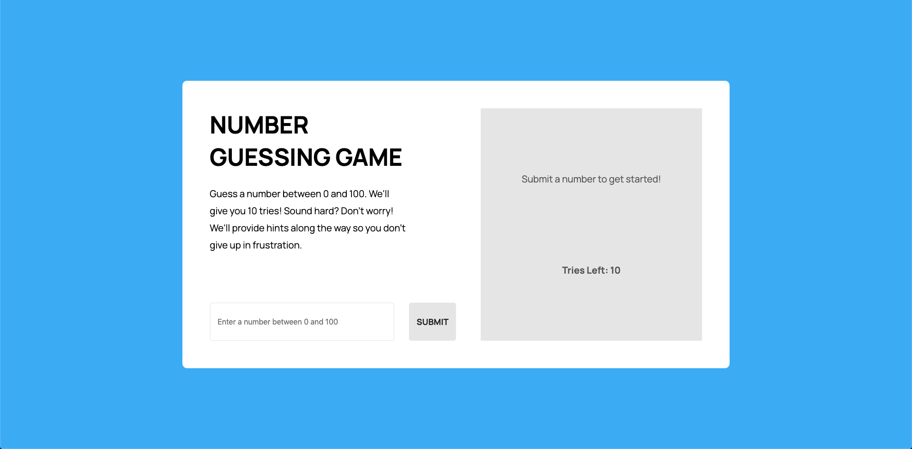

# Number Guessing Game - HTML/CSS/JS

[Link to Completed Web Page](https://brianhyun.github.io/number-guessing-game/)

A game where the user has to guess a random number between 0 and 100, inclusive. Game helps user by providing hints on whether the guessed number is higher or lower than the winning number.

### Demo

### Final Product Screenshot

